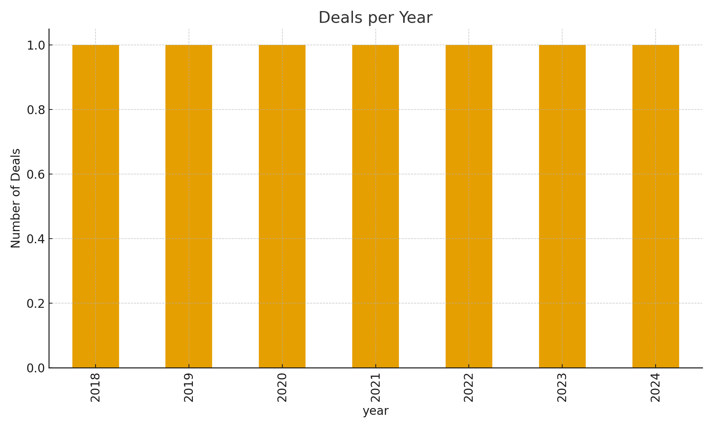

# Global M&A and ESG Trends Analysis

Independent, open-data project exploring patterns between **M&A activity** and **ESG performance** (2018–2024).

## Quickstart
1. Install Python 3.10+
2. Install packages: `pip install pandas matplotlib`
3. Run: `python analysis/analysis.py`
4. See charts in `outputs/`

## Structure
- data/: CSVs (M&A + ESG)
- analysis/: Python script
- outputs/: PNG charts
- Report.md: executive summary
